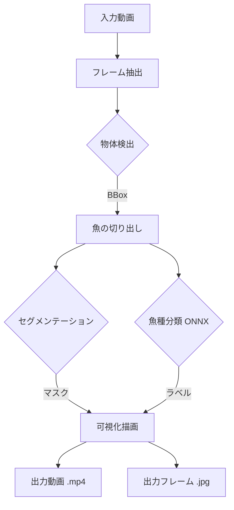

# MarineVideoVisualizer

海洋映像における魚の「検出」「精密切り出し（セグメンテーション）」「魚種分類」を一気通貫で行い、AI解析結果を可視化した動画およびフレーム画像を生成するツールです。

## 主な機能
- **高精度な解析**: 最新のディープラーニングモデルを組み合わせたパイプライン。
- **柔軟な設定**: `config/default_config.yaml` ですべてのモデルパスや動作パラメータを管理。
- **特定魚種のハイライト**: 指定した魚種を赤色、それ以外を青色で強調表示する機能。
- **一括出力**: 動画ファイルに加え、解析済みの全フレーム画像を自動的にフォルダ保存。

---

## 使用モデルの解説

本プロジェクトでは以下の3つのステージで異なるモデルを使用しています。

### 1. 検出 (Detection)
- **YOLO (v8/v12)**: 高速かつ高精度な一般物体検出モデル。
- **GroundingDINO**: テキストクエリ（"fish"など）に基づき、未知の物体も検出可能な「開集合（Open-Vocabulary）」検出モデル。

### 2. セグメンテーション (Segmentation)
- **YOLO-Seg**: 検出と同時に輪郭を抽出する高速モデル。
- **SAM 2 (Segment Anything Model 2)**: 任意の形状を精密に切り出す、Meta社開発のセグメンテーションモデル。

### 3. 魚種分類 (Classification)
- **Swin Transformer**: 画像をパッチ状に分割して解析する最新のバックボーン。
- **ArcFace (Angular Margin Loss)**: クラス間の類似度を角度で管理し、高い識別能を実現する手法。
- **ONNX推論**: PyTorchモデルをONNX形式に変換し、CPU/GPU問わず高速な推論を実行。

---

## 処理フロー



---

## セットアップ

### 1. 依存ライブラリのインストール
```bash
pip install -r requirements.txt
```

### 2. 設定の編集
`config/default_config.yaml` を使用環境に合わせて修正してください。特に、ハイライトさせたい魚種を `highlight_species` に設定できます。

## 使い方

```bash
python main.py --video path/to/your_video.mp4
```

### 命名規則
出力されるファイル/フォルダは以下のルールで自動命名されます。
`[元動画名]_[検出名]_[分類名]_[日付]`

---

## リポジトリ構成
- `config/`: 設定ファイル (YAML)
- `core/`: 検出、セグメント、分類、可視化の各コアモジュール
- `utils/`: 設定読み込み、画像処理ユーティリティ
- `main.py`: プログラムのエントリポイント
